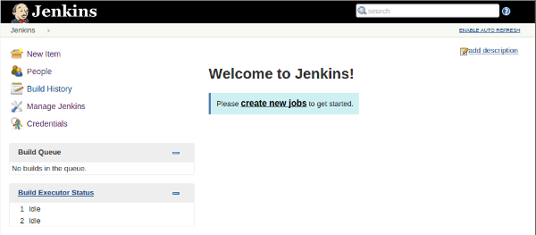
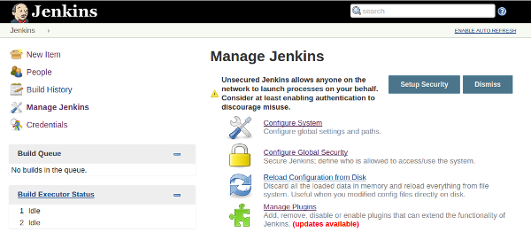
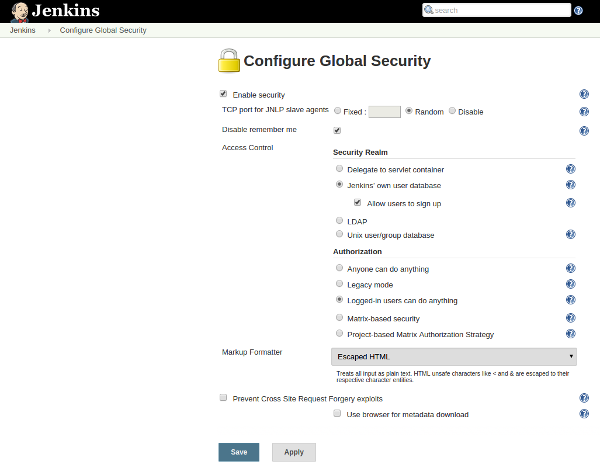

# **Jenkings (Ubuntu Vagrant) + Github Hook**
Formerly know as **JENKINS@localhost with HOOK@github**

This project goal is to be used as a tutorial that offers all the necessary infrastructure to start using Jenkins. 

After completing all the steps displayed here you will:

+ Have an Ubuntu distro (Trusty/Tahr) running in a Vagrant VM;
+ Have Jenkins running (with all necessary plugins);
+ Have Github's Service Hook rsponsible for triggering Jenkins build.

#### Some useful links:

+ https://jenkins-ci.org/
+ https://github.com/

## Assumptions

#### 1) You are using a Debian-Like distro

All this tutorial was tested using **Ubuntu** (Trusty/Tahr) as the host machine for the VM. It means that if you are using another Operating System you must deduce yourself how to "translate" all these steps. 

I believe that for **Unix-like** OSs won't be such a fuzz (i.e. Mac). Windows on the other hand... I have not a clue!

#### 2) You are connected to the internet

I shouldn't have to say that there will be a lot of downloads going on (specially from apt-get). Anyway, you are trying to hook Jenkins and Github! Of course you have an internet connection!

# **Install** VirtualBox / Vagrant

I have used the VirtualBox + Vagrant combination to create a guest machine running my Jenkins server on port 8081.

## Steps:

#### 1) Install Virtualbox:

*"VirtualBox is a powerful x86 and AMD64/Intel64 virtualization product for enterprise as well as home use. Not only is VirtualBox an extremely feature rich, high performance product for enterprise customers, it is also the only professional solution that is freely available as Open Source Software under the terms of the GNU General Public License (GPL) version 2"* ([www.virtualbox.org](www.virtualbox.org "VirtualBox Website"))

    sudo apt-get install virtualbox

See also: [https://www.virtualbox.org/](https://www.virtualbox.org/ "https://www.virtualbox.org/")

#### 2) Install Vagrant:

*"Vagrant provides easy to configure, reproducible, and portable work environments built on top of industry-standard technology and controlled by a single consistent workflow to help maximize the productivity and flexibility of you and your team."* ([Vagrant Docs](https://docs.vagrantup.com/v2/why-vagrant/index.html "Vagrant Documentation"))

    sudo apt-get install vagrant

See also: [https://www.vagrantup.com/](https://www.vagrantup.com/ "https://www.vagrantup.com/")

#### 3) Install GuestAdditions:

*"Guest Additions consist of device drivers and system applications that optimize the guest operating system for better performance and usability."* ([VirtualBox Guest Additions Section](https://www.virtualbox.org/manual/ch04.html#idp94198720 "VirtualBox Guest Additions Section"))

*"vagrant-vbguest is a Vagrant plugin which automatically installs the host's VirtualBox Guest Additions on the guest system."* ([Vagrant Guest Additions on GitHub](https://github.com/dotless-de/vagrant-vbguest "Vagrant Guest Additions"))

    vagrant plugin install vagrant-vbguest

#### 4) Add "Ubuntu Trusty/Tahr" box:

"Ubuntu is a Debian-based Linux operating system, with Unity as its default desktop environment." ([Wikipedia](http://en.wikipedia.org/wiki/Ubuntu_%28operating_system%29 "Ubunut at Wikipedia"))

This will take a while depending on your internet connection.

    vagrant box add ubuntu/trusty64 https://atlas.hashicorp.com/ubuntu/boxes/trusty64/versions/20150427.0.0/providers/virtualbox.box

See also:

1. http://www.ubuntu.com/desktop
2. http://www.olindata.com/blog/2014/07/installing-vagrant-and-virtual-box-ubuntu-1404-lts

# **Download** project files

If you have git, wonderful! Just clone this project!

    git clone git@github.com:alejoceballos/jenkings-vagrant-github.git
    
If not, download the ZIP file and unzip it.

# **Create** the VM

Assuming you performed the previous steps perfectly, just go to "vagrant-jenkins" directory and type:

    vagrant up
    
This will take a while. Be sure you have a good internet connection. If you wanna know what is being installed, check the provisioning shell script files that are executed during VM startup.

## What does provisioning scripts do?

1. **Starts an Ubuntu 14.04 VM with 1 CPU and 1024 MB RAM memory;**
    
    *Working multiple builds and plugins such as "pipeline" showed me that 512 MB wasn't enough.*
    
2. **Forwards port 8080 in guest machine to 8081 in host machine;**

    *If your port 8081 is already being used, you must edit Vagrantfile to choose another port.*

3. **Installs and updates base Ubuntu packages;**

    *For some packages to be installed the english language pack and some other "essential" libraries must be installed/updated.*

4. **Installs Git (apt-get);**

    *To hook Jenkins and GitHub I'll need Git.*

5. **Installs Open JDK and Jenkins (new sources and apt-get);**

    *That's main the point of all of this... Install Jenkins! For that needed to add "jenkins.list" to the "sources.list" (like adding a new PPA). Open JDK 7 is part of the installation, so no need to separately install Java.*


7. **Installs Maven (apt-get);**

    *I'm working with Maven and Java projects. Java and Maven are a MUST to me. At the ime of this writing, the default Maven version for Ubuntu was 3.0.5.*


## Jenkins Plugins

Along Jenkins installation, a set of plugins for Mavane/GitHub integration are downloaded and installed:

1. Git plugin & dependencies;
2. GitHub plugin & dependencies;
3. Pipeline plugin & dependencies.

# **The Jenkins** server

*"Jenkins is an award-winning application that monitors executions of repeated jobs, such as building a software project or jobss run by cron."* ([Meet Jenkins](https://wiki.jenkins-ci.org/display/JENKINS/Meet+Jenkins "Jenkins Docs")) 

After provisioning is done, Jenkins server should be up and running. Open your favorite browser and type the URL:

    http://locahost:8081



## Adding some security

In the next steps you will be able to allow external visibility to your Jenkins management site. **Yes**, it will be visible to anyone in the internet, so I suggest you add some security to your Jenkins server.

### Creating a valid User

TBD

### Managing user security

1. Click on "Manage Jenkins" link (or got to *http://locahost:8081/manage/*)

    

2. Click on "Configure Global Security" (or go to *http://locahost:8081/configureSecurity/*)

    

3. Check "Enable security";

4. I usually check "Logged-in users can do anything", but you can set more sophisticated security options;


# **Allow** Jenkins external visibility

When events are triggered in Github, it must contact our Jenkins server with a message indicating which event has been triggered. 

#### 1) Installing NGROK

*"ngrok allows you to expose a web server running on your local machine to the internet."* ([Getting started with NGROK](https://ngrok.com/docs#expose "NGROK"))

Install ngrok in your HOST machine, not guest. Remember that port 8080 in guest is already being forwarded to 8081 in host by Vagrant script.    

    sudo apt-get install ngrok-client
    
#### 2) Running NGROK

In host, run:

    ngrok 8081    

After executing the command above, something similar to the output below must be shown in your terminal:

    ngrok                                              (Ctrl+C to quit)
    
    Tunnel Status   online                                                                       
    Version         1.6/1.7                                                                      
    Forwarding      http://somehexadecimal.ngrok.com -> 127.0.0.1:8081                                  
    Forwarding      https://somehexadecimal.ngrok.com -> 127.0.0.1:8081                                 
    Web Interface   127.0.0.1:4040                                                               
    # Conn          0                                                                            
    Avg Conn Time   0.00ms                                                                       

#### 3) Testing NGROK

Copy the exact forwarded URL that is shown in your terminal (i.e. "*somehexadecimal.ngrok.com*") and paste it to your browser. You should see the same Jenkins main page as in "*http://localhost:8081*".

## Creating a new Project

Since I'm working with Java I created a new Maven Project.

"Apache Maven is a software project management and comprehension tool. Based on the concept of a project object model (POM), Maven can manage a project's build, reporting and documentation from a central piece of information." ([Maven Site](https://maven.apache.org/ "Maven"))

TBD

# **Setting** Github's Event Webhook

TBD 


#### Useful links:

https://developer.github.com/webhooks/

#### References:

# **Creating** a new Jenkins Maven Project

TBD 

#### References:

+ https://github.com/juretta/hudson-github-plugin/issues/4
+ https://github.com/{user}/{project}/settings/hooks
+ https://developer.github.com/webhooks/
+ https://github.com/juretta/hudson-github-plugin/issues/4
+ http://nepalonrails.tumblr.com/post/14217655627/set-up-jenkins-ci-on-ubuntu-for-+ painless-rails3
+ http://www.svenbit.com/2014/09/run-ngrok-on-your-own-server/
+ http://stackoverflow.com/questions/10018496/run-tests-in-jenkins-automatically-+ after-each-commit-change
+ https://developer.github.com/webhooks/testing/
+ https://developer.github.com/webhooks/creating/
+ https://developer.github.com/webhooks/configuring/

+ http://zeroturnaround.com/rebellabs/how-to-use-jenkins-for-job-chaining-and-visualizations/#outoftheboxs

# **Thanks to...**

... The development team and supporters of the applications below, without them I could not even start this project at such low cost (I'm $upporting some of them, just to let you know):
+ Git - [http://git-scm.com/](http://git-scm.com/ "http://git-scm.com/")
+ GitHub - [https://github.com/](https://github.com/ "https://github.com/")
+ Google Chrome - [http://www.google.com/chrome/](http://swww.google.com/chrome/ "http://www.google.com/chrome/")
+ Java - ...
+ Jenkins - ...
+ Maven - ...
+ MdCharm - [http://www.mdcharm.com/](http://www.mdcharm.com/ "http://www.mdcharm.com/")
+ Mozilla Firefox - [https://www.mozilla.org/en-US/firefox/new/](https://www.mozilla.org/en-US/firefox/new/ "https://www.mozilla.org/en-US/firefox/new/")
+ Ubuntu Desktop - [http://www.ubuntu.com/desktop](http://www.ubuntu.com/desktop "http://www.ubuntu.com/desktop")
+ Oracle VirtualBox - ...
+ Vagrant - ...

+ All Jenkins plugins people...

I could thank to [Intellij IDEA](https://www.jetbrains.com/idea/ "Intellij IDEA") team and all the guys in JetBrains, but since I'm paying for their software, I won't.

# By the way...

If you find any broken link, English mistakes (there must be tons) or any type of fix you think its worth of noticing... Please, **contact me**! My contact info can be found in my **GitHub** profile. Thanks!

[ [https://github.com/alejoceballos](https://github.com/alejoceballos "https://github.com/alejoceballos") ]

# **License**
```
The MIT License (MIT)

Copyright (c) 2015 Alejo Ceballos

Permission is hereby granted, free of charge, to any person obtaining a copy
of this software and associated documentation files (the "Software"), to deal
in the Software without restriction, including without limitation the rights
to use, copy, modify, merge, publish, distribute, sublicense, and/or sell
copies of the Software, and to permit persons to whom the Software is
furnished to do so, subject to the following conditions:

The above copyright notice and this permission notice shall be included in all
copies or substantial portions of the Software.

THE SOFTWARE IS PROVIDED "AS IS", WITHOUT WARRANTY OF ANY KIND, EXPRESS OR
IMPLIED, INCLUDING BUT NOT LIMITED TO THE WARRANTIES OF MERCHANTABILITY,
FITNESS FOR A PARTICULAR PURPOSE AND NONINFRINGEMENT. IN NO EVENT SHALL THE
AUTHORS OR COPYRIGHT HOLDERS BE LIABLE FOR ANY CLAIM, DAMAGES OR OTHER
LIABILITY, WHETHER IN AN ACTION OF CONTRACT, TORT OR OTHERWISE, ARISING FROM,
OUT OF OR IN CONNECTION WITH THE SOFTWARE OR THE USE OR OTHER DEALINGS IN THE
SOFTWARE.
```
